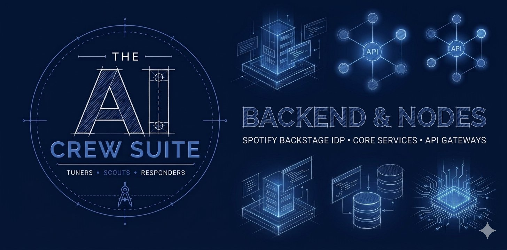

# AI Crew Suite Core Plugins



AI Crew Suite is a Backstage plugin workspace for building retrieval-augmented, tool-using AI agents inside a developer portal. It began as a fork of the Roadie RAG AI plugins, but the architecture has been reshaped from a single assistant that answers one retrieval-backed question into a core platform for agents, crews, provider modules, runtime persistence, and structured execution streams.

This repo includes the heart of the project: the core backend plugin that provides a fluent API for creating graph runners in user-facing backend plugins, and its node plugin counterpart providing shareable types and convenient utilities. It also includes a common frontend library plugin for agents.

## 🏗️ Development Workflow

This repository is a Backstage monorepo using Yarn 4 Plug'n'Play, Turbo, TypeScript project references, and package-local plugin builds.

**Prerequisites:**

- Node.js `>=22.22.2`
- Yarn `4.17.1`, as declared by `packageManager`

### 1. Installation & Builds

Run installation routines and build compilation tracks directly from the monorepo root so Yarn PnP and workspace references resolve correctly:

```bash
# optional refresh flag forces full install if wanted
yarn install --refresh
yarn turbo run build
```

### 2. Running Unit & Integration Tests

```bash
yarn turbo run lint
yarn turbo run test:unit
```

### 3. Run Scripts in a Single Package

Add a `--filter`  flag to the command:

```bash
yarn turbo run test:unit --filter=@ai-crew-suite/plugin-kernel-backend
```

## 📚 Documentation

When adding or changing a core backend module, update the matching package README and the relevant page in the [documentation site repo](https://github.com/ai-crew-suite/documentation).

## 🚀 Release & Publication Management

Publish a new version:

```bash
yarn turbo run publish
```

- Proxies `yarn changeset publish` to orchestrate multi-package version increments.
- Integrates seamlessly with the npm/Yarn lifecycle hooks (`prepack` / `postpack`) declared inside individual frontend and backend plugins, ensuring distribution tarballs carry fully compiled, production-ready path definitions during registry deployment passes.

## 🔒 Security Governance

### Protecting Against ReDoS (Regular Expression Denial of Service)

The `ConfigurableRedactorAdapter` allows operators to append custom matching patterns via the `ai.redaction.*` configuration tree in `app-config.yaml`. While this provides excellent runtime flexibility, introducing unverified, nested, or complex custom regular expressions (e.g., `(a+)+`) can expose the server to **ReDoS attacks** via catastrophic exponential backtracking.

Because Node.js executes JavaScript on a single-threaded event loop, a single ReDoS payload can peg a CPU core to 100%, freezing the entire container cluster node.

To completely eliminate this vulnerability and establish a bulletproof security ceiling, **operators must enforce native V8 linear backtracking limits at the process level.** This ensures that if any custom regular expression attempts excessive backtracking, the V8 engine terminates the match instantly with a safe exception rather than locking the thread thread.

## ⚙️ Deployment Configuration Options

You can enforce this a ceiling against ReDoS in your infrastructure containers using either of the following environment variable configurations.

#### Approach 1: Dedicated V8 Injection Variable (Recommended)

This approach targets the V8 engine parameter registers directly, bypassing standard Node.js CLI string parsers and eliminating the risk of runtime shell argument syntax errors.

```bash
# Add this line to your Dockerfile, Kubernetes Deployment manifest, or container environment
export NODE_V8_FLAGS="--max_reg_exp_backtracks=1000"
```

#### Approach 2: Standard Node Options Envelope

If your production infrastructure standardizes on the global `NODE_OPTIONS` injection vector, you must wrap the target engine configuration parameters inside the `--v8-options` assignment mask.

```bash
# Ensure there are no spaces between the assignment flags
export NODE_OPTIONS="--v8-options=--max_reg_exp_backtracks=1000"
```

## 🔊 Get involved

### Issues and Discussions

Please open a [Discussion](https://github.com/ai-crew-suite/core/discussions) to get help, suggest a new feature, or to report a bug. We only want maintainers to open Issues.

- [GitHub Discussions for AI Crew Suite Core](https://github.com/ai-crew-suite/core/discussions)

### Contributing

To contribute to AI Crew Suite, please read the contributing guidelines.

- [Guidelines for Contributing](https://github.com/ai-crew-suite/core/blob/main/.github/CONTRIBUTING.md)

### Contact and Social Media

The AI Crew Suite project is proudly supported and actively maintained by Webstack Builders.

- Contact [Webstack Builders](https://webstackbuilders/contact/) for commercial support questions.

Follow us on:

- BlueSky: [social@ai-crew-suite.dev](https://ai-crew-suite.bsky.social)
- LinkedIn: [linkedin.com/company/ai-crew-suite](https://linkedin.com/company/ai-crew-suite)

## 🛡️ Security / Disclosure

If you find any bug with AI Crew Suite that may be a security problem, please report it through the [GitHub Security Advisories process](https://github.com/ai-crew-suite/core/security/advisories). This way we can evaluate the bug and hopefully fix it before it gets abused. Please give us enough time to investigate the bug before you report it anywhere else.

If you would like to discuss a potential finding before raising the Advisory, then e-mail us at [security@ai-crew-suite.dev](mailto:security@ai-crew-suite.dev).

## ©️ Compliance and Licensing

Copyright © 2026 The AI Crew Suite Authors.
Licensed under the **Apache License, Version 2.0**.
