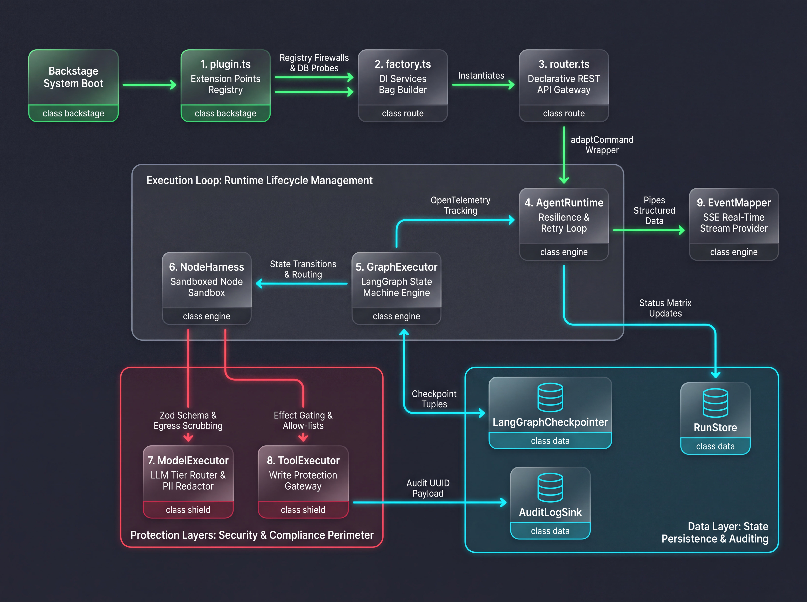

# Runtime Description

**The Fully Assembled System**



The LangGraph Core Backend architecture matches this structure:

| Component                   | Responsibility                                               |
| --------------------------- | ------------------------------------------------------------ |
| **`AgentRuntime`**          | Manages outer HTTP streaming lifecycle, database records, and global resilience/retry loops. |
| **`GraphExecutor`**         | Executes the compiled state machine loop, evaluates dynamic routing paths (`edges`), and coordinates checkpoints. |
| **`NodeHarness`**           | Wraps individual graph steps to handle timeouts, data redaction, and Zod state validation contracts. |
| **`ModelExecutor`**         | Resolves model capability tiers, handles raw chunk token streaming, and tracks input/output token usage. |
| **`ToolExecutor`**          | Enforces tool allow-lists, evaluates RBAC rights, requires manual gates for `write` tools, and populates audit logs. |
| **`LangGraphCheckpointer`** | Adapts internal plugin DB configurations into LangGraph-compliant thread states via customizable serializers. |
| **`EventMapper`**           | Unifies diverse internal events into a standardized `AgentEvent` stream for the frontend UI. |

## Plugin Overview

The combining code snippets define the **`ragAiPlugin`** core module. It serves as the **root orchestrator and plugin definition** for the Backstage backend framework (built using the modern Backstage **Backend System Alpha/New Architecture**).

Instead of hardcoding what models, agents, tools, or data pipelines exist, this file acts as a **pluggable chassis**. It exposes specific **Extension Points** that other Backstage plugins can attach to, dynamically collecting code pieces before booting the fully validated `AgentRuntime` engine and exposing its REST routes via the Express `httpRouter`.

### Core Responsibilities

1. **Extension Point Registry Strategy**: Exposes hooks (e.g., `agentExtensionPoint`, `toolExtensionPoint`) that follow the open-closed design principle. Other internal Backstage plugins can easily contribute custom capabilities without modifying the core engine code.
2. **Strict Singularity Enforcements**: Implements validation guards across all extensions (e.g., `if (agents.has(...)) throw new Error(...)`). This prevents overlapping collisions if different modules accidentally attempt to claim the same model, tool, or repository namespace.
3. **Proactive Database Compliance Probe**: During the `init` phase, it obtains a database client wrapper via Knex and runs an explicit sanity check (`SELECT 1`). If the persistent storage layer is down, it intentionally halts system startup.
4. **Stateful Rate Limiting**: Mounts an `AgentRateLimiter` right at the infrastructure layer, preventing script errors or recursive automated agent behavior from running up costly enterprise LLM invoices.
5. **Declarative Component Mounting**: Feeds all collected structures into `createAiBackendServices`, hooks up the underlying rate limiting rules, passes the fully rehydrated services bag to the `createRouter`, and registers it cleanly using Backstage’s `httpRouter.use()`.

### Detailed Architectural Walkthrough

#### The Extension Phase (Gathering Components)

When Backstage boots up, it reads the plugin's exposed registries. Other plugins register extensions onto it:

- **`chatModelsExtensionPoint` & `toolExtensionPoint`**: Dynamic targets to link up specific models and tools.
- **`agentExtensionPoint` & `workflowRunnerExtensionPoint`**: Injects compiled multi-agent profiles and LangGraph layout workflows.
- **`runtimeStoreExtensionPoint`**: Binds the explicit database adapters (e.g., `RunStore`, `CheckpointStore`) used to achieve time-machine capabilities.

#### The Init Phase (Firing Up Engines)

Once extensions are loaded, Backstage invokes `async init(...)`:

- It triggers the compliance probe on the database client to verify a live connection.
- It provisions the runtime configurations via the `createAiBackendServices` builder pattern we reviewed earlier.
- It wraps the rate-limiting callback using function binding (`rateLimiter.consume.bind(rateLimiter)`) so that individual HTTP endpoints can safely count user query volume without leaking internals.
- Finally, it wraps the pipeline using `createRouter` and injects the resulting declarative Express interface context straight into the primary global runtime router layer.

## Router Overview

The **`router.ts`** file serves as the **declarative API gateway and endpoint manager** for your Backstage AI backend plugin.

Instead of embedding explicit business logic, validation chains, or HTTP status writes directly into route callbacks, this file acts strictly as a **traffic controller**. It establishes a mapping between public REST paths and highly isolated command objects (like `StartRunCommand` or `StreamRunEventsCommand`) using a specialized `adaptCommand` middleware function.

### Core Responsibilities

1. **Declarative Routing Infrastructure**: Employs an `express-promise-router` to ensure asynchronous operations bubble errors up safely. It maps explicit system actions directly onto standard REST patterns (`POST`, `GET`, `DELETE`).
2. **Command Pattern Adaptation (`adaptCommand`)**: Wraps and translates traditional, messy Express payloads (`req`, `res`, `next`) into distinct, sandboxed command handlers. This keeps HTTP parsing concerns completely isolated from execution mechanics.
3. **Dependency Injection Distribution**: Channels core services (such as the `AgentRuntime`, `RunStore`, and custom security registries) to the specific command sub-modules that require them at runtime.
4. **Multi-Domain Endpoint Management**: Exposes three critical runtime domains:
   - **Agent Lifecycle**: Creating, streaming, and manually approving long-running multi-agent workflow processes.
   - **Vector Search / RAG System**: Methods to create, remove, and semantically retrieve code embeddings.
   - **Automated Event Pipes**: Triggering pipelines and webhook listeners to react to third-party infrastructure events.
5. **Standardized Error Handling Integration**: Interceptors errors using Backstage's unified `MiddlewareFactory.error()` handler to filter stack traces and provide safe, formatted errors back to the frontend.

### Endpoint Architecture Mapping

The file organizes the plugin’s entire feature set into clear functional areas:

#### The Multi-Agent Workflow Runway

- **`POST /agents/:id/runs`** (`StartRunCommand`): Accepts a prompt query from the user interface, verifies the rate-limit ceiling, initializes database steps, and boots up a LangGraph execution track.
- **`GET /runs/:id/events`** (`StreamRunEventsCommand`): Opens a **Server-Sent Events (SSE)** connection allowing real-time token fragments and execution updates to stream continuously down to the user's browser.
- **`POST /runs/:id/approvals`** (`ApproveRunCommand`): Resolves human-in-the-loop gates. This allows a user to authorize a paused node to proceed (e.g., confirming a state mutation or continuing past a budget checkpoint).

#### Retrieval-Augmented Generation (RAG) & Vector Data Space

- **`POST /embeddings/:source`** (`CreateEmbeddingsCommand`): Ingests target data (like Backstage catalog definitions or codebase documentation) to index into your vector database.
- **`DELETE /embeddings/:source`** (`DeleteEmbeddingsCommand`): Purges outdated document fragments or vector records for a specific metadata partition.
- **`GET /embeddings/:source`** (`GetEmbeddingsCommand`): Executes semantic vector queries across documents via your `RetrievalPipeline` to inject context directly into LLM prompts.

#### Automation and Ingestion Track

- **`POST /triggers/:source`** (`TriggerRunCommand`): Listens for internal system alerts or catalog mutation events to kick off an agent automatically.
- **`POST /webhooks/:provider`** (`WebhookRunCommand`): Acts as a secure public boundary endpoint to handle alerts arriving from third-party ecosystems (e.g., GitHub webhooks, Jira events, or CI/CD pipelines).

## Factory (Services Builder) Overview

This file acts as the **Boot-Time Dependency Injection (DI) Factory and Security Firewall** for your Backstage AI plugin.

Instead of letting individual runtime components spin up their own unverified connections or configuration layouts, this factory serves as the single centralized boot manager. It aggregates all structural plugin configurations (models, workflows, tools, and storage sinks), runs an **enterprise validation check** to catch developer misconfigurations immediately at application startup, and bundles them into a clean dependency bag (`AiBackendServices`) ready for the Backstage backend router.

### Core Responsibilities

1. **Enterprise Boot-Time Validation (`validateResolvedAgents`)**: Prevents runtime errors by running strict structural integrity checks before the server even begins listening for network traffic. If an agent references a missing model handle, an unregistered tool, or a typoed workflow graph, it halts application boot instantly.
2. **Dynamic Source Registration (`createSourceRegistry`)**: Manages the mutable tracking engine responsible for handling where inputs originate (e.g., specific Backstage catalog pages, software templates, or external scaffolding events).
3. **Runtime Engine Assembly**: Instantiates the high-level operational layers by joining `AgentRuntime` with a freshly established `GraphExecutor` instance.
4. **Resilience & Hardening Configuration Mapping (`toHardeningOptions`)**: Extracts structural stability thresholds (like global execution timeouts, node duration caps, token budgets, and rate-limiting margins) from standard Backstage `app-config.yaml` fields and maps them into type-safe kernel inputs.
5. **Dependency Injection Packaging**: Normalizes disparate infrastructure components (session tracking databases, artifact endpoints, audit logging sinks) into a cohesive service layer directly consumable by the Backstage framework router.

### Breakdown of Key Methods & Mechanisms

1. Boot Safeguard Firewall (`validateResolvedAgents`)

```typescript
for (const agent of agents.values()) {
  if (!models.has(agent.modelRef)) throw new Error(...);
  if (agent.workflowRef && !workflows.has(agent.workflowRef)) throw new Error(...);
  for (const toolId of agent.toolIds) {
    if (!tools.has(toolId)) throw new Error(...);
  }
}
```

**Why it's crucial:** This protects you from catastrophic mid-graph runtime execution failures. It guarantees that any mismatch between code-registered custom tools and agent metadata configurations is caught during local development or CI/CD startup pipelines.

### Runtime Interlinking

```typescript
const runtime = new AgentRuntime(
  agents,
  new GraphExecutor(workflowDefinitions, null as never, ...),
);
```

**What it does:** This builds the operational core we examined in previous files. It initializes the `GraphExecutor` and embeds it directly into the `AgentRuntime` lifecycle wrapper. *(Note: The structural placeholders cast as `null as never` point to parts of your architecture that are likely injected dynamically at query-execution runtime or are waiting for concrete implementation hooks).*

### Configuration Extraction (`toHardeningOptions`)

**What it does:** Safely references optional configuration objects defined under the root `ai:` block of your Backstage architecture. This populates network safety keys (e.g., `maxRetries`, `timeoutMs`, `rateLimitPerMinute`) so the `AgentRuntime` retry loops can throttle misbehaving agents or models.

## AgentRuntime Overview

The **`AgentRuntime`** class acts as the outer **orchestrator and lifecycle manager** for your Backstage AI plugin's core backend.

It does not handle the internal logic of how an AI agent thinks or walks through graph nodes—that responsibility is delegated to the `GraphExecutor`. Instead, `AgentRuntime` acts as the operational wrapper that sets up OpenTelemetry tracing, manages database state persistence, implements a resilience/retry loop, and translates the underlying workflow events into a stream for the client.

### Core Responsibilities

1. **Input Validation**: Verifies that the requested `agentId` exists and has an associated `workflowRef` (the LangGraph configuration mapping) before attempting to spin up resources.
2. **Persistence Management**: Creates initial records in the database (`createRunRecord`) and handles final status updates (`processRunEvent`, `failRun`) using the provided database context.
3. **Resilience & Retry Loop**: Implements exponential backoff logic (e.g., `retryBackoffMs * 2 ** attempt`). If the underlying `GraphExecutor` throws an error, `AgentRuntime` catches it, sleeps, and retries the process until `maxRetries` is exhausted.
4. **Telemetry and Observability**: Uses OpenTelemetry (`@opentelemetry/api`) to trace the execution lifecycle (`ai.run`), tracking tokens, durations, and metadata attributes for monitoring.
5. **Context Building**: Standardizes factories for `ToolExecutor` and `ModelExecutor` so that execution nodes down the line have clean, sandboxed interfaces to query LLMs and invoke tools.

### Breakdown of Key Methods

#### `run(input, ctx)`

**What it does:** The primary entry point. It returns an `AsyncIterable<AgentEvent>`, enabling real-time streaming updates to the frontend or user interface.

**How it works:**

1. Checks if the agent is valid; yields immediate error packets if not.
2. Launches an OpenTelemetry span.
3. Loops up to `maxRetries`. On each attempt, it invokes `this.executor.run(...)`.
4. As the graph execution progresses, it intercepts events using `processRunEvent` to accumulate total token usage and catch budget errors before forwarding the event onto the consumer.

#### `resume(runId, decision, ctx)`

**What it does:** Prepared placeholder for human-in-the-loop functions.

**How it works:** Currently stubbed out to instantly return a `'done'` event. When fully implemented, this will handle unpausing graphs that hit manual authorization steps (e.g., approving a dangerous deployment or a costly tool execution).

#### `createRunContext(ctx, agent)`

**What it does:** Generates the runtime dependencies that LangGraph execution nodes require.

**How it works:** Provides structural factories for generating tools and model invocations. Note that these are currently stubbed/mocked out using inline functions—you will likely replace these placeholders with real client instances later.

#### `processRunEvent(...)`

**What it does:** Hooks into the live stream of events passing from the execution engine to the end-user.

**How it works:** Updates metrics attributes inside the tracing span and listens for `'done'` or `'error'` events to automatically update the run state in the persistence store (`runStore`).

## GraphExecutor Overview

The **`GraphExecutor`** class is the **state machine and execution engine** for your AI backend. While `AgentRuntime` manages global concerns like API streaming and retries, `GraphExecutor` is responsible for compiled graph validation, tracking workflow state, evaluating routing conditions, and stepping through nodes from entry to exit.

### Core Responsibilities

1. **Boot-Time Validation**: Validates all registered `WorkflowDefinitions` during class initialization. If a workflow definition breaks the schema rules, it throws a `NodeError` immediately to prevent runtime failures.
2. **Dynamic Routing Engine**: Controls graph execution using a `while (current !== END)` loop. It moves from node to node by checking manual transitions (`to` edges) or dynamically calculating routes (`route` edges) based on the updated state.
3. **State Management & Patching**: Manages the workflow state. It parses inputs using Zod/schema rules, passes the state down to execution nodes, and overlays updates ("patches") returned by completed nodes onto the primary state object.
4. **Checkpointing & Persistence**: Integrates with a `LangGraphCheckpointer`. After a node executes successfully, it saves a snapshot containing the `runId`, the sequence number (`seq`), the next destination node, and the current state payload.
5. **Interrupt Gate Handling**: Inspects nodes for pre-configured human-in-the-loop actions (`interrupts`). If an interrupt trigger matches the next node, it emits an approval request before running the node's underlying code.
6. **Telemetry & Event Emission**: Utilizes an `EventMapper` to structure trace details (`step enter`, `step exit`, `artifact production`, and `done`) into a uniform telemetry pipeline.

### Breakdown of Key Areas

#### Constructor Validation

**What it does:** Ensures graph safety before processing requests.

**How it works:** Loops over the `definitions` map on instantiation and calls `validateWorkflowDefinition(def)`. If it detects missing endpoints, disconnected components, or broken structures, it aborts immediately.

#### The Execution Loop (`run`)

**What it does:** Moves the graph step-by-step through execution until it reaches the `END` token.

**How it works:**

- **Input Parsing:** Cleans up the incoming payload through `def.inputSchema.parse`.
- **Interrupt Processing:** Looks for matching boundaries inside `def.interrupts`. If a match is found, it uses the `EventMapper` to request approval.
- **Node Execution:** Instantiates a new `NodeHarness` to safely execute the node. The node is provided a context object including tools (`toolExecutorFactory`), LLMs (`modelExecutorFactory`), and an event wrapper (`emitArtifact`).
- **State Integration & Checkpointing:** The resulting payload patch is applied back to the core state, which is then immediately saved via `this.checkpointer.put(...)`.
- **Edge Evaluation:** Finds matching edges where `from === nodeName`. If the edge specifies a fixed target (`'to' in edge`), it proceeds there. If it is a conditional edge (`'route' in edge`), it executes the routing function against the current state to dynamically find the next target.

### Interleaving with NodeHarness

The executor isolates each step by delegating execution to the `NodeHarness`. This strategy prevents a failing node function from corrupting the core loop execution state directly and ensures input/output formatting rules are strictly applied.

## ModelExecutor Overview

The **`ModelExecutor`** class is the **gateway to Large Language Models (LLMs)** for your workflow graph. It wraps LangChain's `BaseChatModel`, abstracting model references behind logical performance "tiers" (like *fast*, *smart*, etc.). It manages token parsing, real-time chunk streaming, and applies a critical redaction layer to ensure data security (e.g., stripping out PII, HIPAA, or PHI data) before text is sent to or returned from the LLM.

### Core Responsibilities

1. **Abstraction and Tier Resolution**: Maps abstract performance layers or tier names (e.g., `'fast-llm'`) to concrete model implementations (e.g., GPT-4o or Claude 3.5 Sonnet) configured in Backstage.
2. **Safe Token Streaming**: Wraps LangChain's async stream interface. As the LLM responds, it captures raw chunks, extracts the delta text fragments, and yields them to the execution engine.
3. **Token Accounting & Usage Metrics**: Tracks real-time token consumption (`input_tokens`, `output_tokens`, `total_tokens`) as provided by the model's native metadata, yielding regular usage updates.
4. **Data Redaction & Masking**: Intercepts prompts using a `Redactor` utility prior to transmission, ensuring compliance and data protection standards are enforced automatically at the engine layer.
5. **Contextual Scaling (`forTier`)**: Allows workflow nodes to dynamically swap their computational engine on the fly (e.g., shifting down to a cheap model for basic parsing, or upgrading to a premium model for complex routing decisions).

### Breakdown of Key Methods

#### `resolveModel()`

**What it does**: Determines which explicit LLM instance to load.

**How it works**: Looks at the agent's target `modelRef`. It checks the dictionary of `tiers` first to see if it stands for a generic key (like `smart`). If not found, it assumes it's a direct reference string and queries the internal `models` map, throwing a `NodeError` if the model configuration is missing.

#### `forTier(tier)`

**What it does**: Spawns an ephemeral clone of the executor locked to a specific capability level.

**How it works**: Clones the parent config but overrides the `modelRef` target with the requested tier. This allows an execution node to do things like `ctx.model.forTier('cheap').invoke(...)` without losing telemetry or redactor context.

#### `stream(input)`

**What it does**: Provides the real-time token generator consumed by streaming outputs.

**How it works**:
  - Applies the `redactor` filter to clean up input contents.
  - Initiates the underlying `model.stream(...)`.
  - Uses a `for await...of` loop to continuously intercept chunks. It safely checks for standard LangChain `usage_metadata` fields to calculate ongoing operational expenses and yields text updates concurrently.

#### `invoke(input)`

**What it does**: A non-streaming convenience wrapper.

**How it works**: Simply runs the `stream` method internally, concatenating all coming textual string segments into a single resolved response block before returning.

## ToolExecutor Overview

The **`ToolExecutor`** class serves as the **central gateway and security checkpoint** for all tool invocations within your workflow nodes. Instead of letting LLMs or arbitrary graph nodes execute external code freely, `ToolExecutor` wraps all execution requests to enforce strict allow-lists, role-based controls, data auditing, and mutation safeguards (such as read/write permissions).

### Core Responsibilities

1. **Allow-list Verification**: Checks the agent's explicit definition to ensure the requested `toolId` is explicitly permitted for that specific agent before proceeding.
2. **Effect Gating (State Mutation Protection)**: Validates if a tool modifies system state (`tool.effect === 'write'`). If a tool is a write action, it blocks execution unless the parent graph explicitly crossed an approved human-in-the-loop interrupt gate (`approvedWrite = true`).
3. **Data Redaction & Governance**: Ensures that argument payloads passed into audited write tools pass through a `Redactor` utility to filter out sensitive details (such as PII or internal credentials) prior to persistent log storage.
4. **Audit Logging Compliance**: Partners with an `AuditLogSink` to automatically record a detailed, unalterable trail of state-changing tool executions including details about the actor, payload, and enclosing run.
5. **Execution Context Management**: Furnishes downstream tools with unified runtime indicators like timeouts, abort signals, system logging hooks, and Backstage actor identity headers.

### Breakdown of Key Operations within `invoke`

#### Security & Constraints Validation

- The method begins by cross-checking `input.toolId` against `this.agent.toolIds`. If a developer or a compromised LLM attempts to call an unassigned utility, it immediately drops execution with a `tool_denied` status error.
- It looks up the registration in the `ToolRegistry`. If it is absent, it throws a `tool_failed` error.

#### Write-Protection Gate

```typescript
if (tool.effect === 'write' && !this.approvedWrite) {
  throw new NodeError(`Write tool '${input.toolId}' requires an approved interrupt gate`, 'tool_denied');
}
```

This prevents dangerous automated behaviors (like modifying a production Backstage entity or running destructive terminal tasks) unless a user has verified and unpaused the workflow through an interrupt boundary.

#### Dispatch & Output Generation

- Calls the underlying `tool.invoke` using standard runtime configurations (`runId`, `logger`, `identity`).
- If the tool ran a write operation successfully, it builds a randomized operational trace entry using `randomUUID()` and dispatches the sanitized parameters directly to the plugin's `auditLogSink`.
- Finally, it wraps the data back into a standardized format containing the `toolId`, the typed `output`, and an explicit placeholder string for execution summaries.

## EventMapper Overview

The **`EventMapper`** class acts as the **central translation layer and event factory** for the plugin's execution engine. As the workflow runs, diverse internal state changes occur (such as structural graph movement, raw streaming LLM text chunks, tool executions, and runtime validation errors). `EventMapper` accepts these messy runtime signals and normalizes them into structured, type-safe `AgentEvent` objects that the UI frontend or consumer can easily parse.

### Core Responsibilities

1. **Centralized Standardization**: Serves as the single place in the architecture where schema transformations for events are defined. If the underlying data format of the frontend updates, this is the only file that needs modification.
2. **Sequence Tracking**: Maintains an internal incrementing sequence counter (`this.seq`) for structural execution steps. This allows consumer interfaces to guarantee the correct chronological ordering of active workflow execution pathways.
3. **Event Classification**: Formats every operation into a recognizable, predictable lifecycle hook mapping directly to specific UI features (like streaming chat views, execution progress bars, tool execution logs, or popup modal authorization prompts).

### Breakdown of Supported Events

The class provides targeted mapping methods for every operational facet of a running LangGraph graph:

#### `step(runId, node, phase)`

*Purpose:* Tracks structural progress by recording exactly when the engine steps into or exits a specific graph layout boundary (`'enter' | 'exit'`).

#### `token(runId, node, text)`

*Purpose:* Handles real-time LLM chat streaming, attributing incoming text chunks directly back to the active generating node.

#### `toolCall` & `toolResult`

*Purpose:* Documents external interactions. Logs the intent to fire an external script (along with parameters), followed by whether the execution completed successfully (`ok: boolean`), structural output arrays, and contextual summarizations.

#### `usage(runId, input, output, total, node)`

*Purpose:* Relays token economics data. Communicates model consumption costs (prompt tokens vs. completion tokens) for auditing or user budgeting alerts.

#### `artifact(runId, kind, ref, url)`

*Purpose:* Registers generated assets (such as an uploaded catalog component file, markdown reports, or documentation logs) produced by the agent.

#### `approvalRequest(runId, approvalId, node, reason, effect)`

*Purpose:* Triggers human-in-the-loop blocking interfaces. Flags that the backend is currently waiting for human intervention due to a pending operation (like a write action).

#### `done` & `error`

*Purpose:* Endpoints representing lifecycle termination, ensuring either final closure or rich error reporting indicating whether an operation is safely retryable.

## LangGraphCheckpointer Overview

The **`LangGraphCheckpointer`** class serves as the **persistence adapter and state time-machine** for your Backstage AI plugin.

It acts as a bridge between the plugin’s global data storage layer (`CheckpointStore`) and the execution state requirements of the graph framework. By continuously saving the graph's layout position and workspace variables after every node completes, this class enables features like **resuming from failure**, **long-running execution pauses (human-in-the-loop interrupts)**, and **complete history replays for debugging**.

### Core Responsibilities

1. **Framework Decoupling**: Translates standard LangGraph checkpoint requirements (like thread tracking, fetching execution tuples, and state saving) into operations that match your internal Backstage plugin data schema (`CheckpointStore`).
2. **State Serialization & Compression**: Houses an optional `StateSerializer` layer. If a custom serializer is supplied, it encodes complex runtime Javascript object states into compact binary or string shapes (`Uint8Array` / compressed JSON) for safe database storage, decoding them back seamlessly when fetched.
3. **Idempotence & Crash Recovery**: Relies on a compound tracking anchor (`runId` paired with the event sequence `seq`). If `AgentRuntime` triggers a retry loop due to a node failure, the system can fetch the exact execution snapshot from the checkpointer and restart the process safely without duplicating database records.
4. **Historical Auditing & Replay**: Exposes history tracking endpoints (`list`) so developers can view every progressive state mutation from node to node, allowing for comprehensive diagnostic tracing.

### Breakdown of Key Operations

#### State Retrieval (`get` & `getTuple`)

- **`get(runId)`**: Fetches the raw, un-inflated latest row available for a specified execution run.
- **`getTuple(runId)`**: Serves as the primary extraction mechanism for the execution engine. It retrieves the latest state snapshot, passes it through the `StateSerializer` (if present) to rehydrate data structures, and formats it into a strict `[runId, nextNode, state]` tuple that `GraphExecutor` uses to calculate the next operational steps.

#### Writing States Safely (`put`)

**How it works**: Invoked immediately after a node patches the state in the `GraphExecutor`. It takes the active graph position, packages it into a `CheckpointRecord`, runs it through the `serialize` pipeline, and writes it immediately to the persistent store.

#### Cleanup & Housekeeping (`deleteThread`)

**How it works**: Acts as a tombstone execution engine. Once a thread run is fully finalized, or if a temporary draft run is discarded, it completely wipes out all historic checkpoints associated with that `runId` to keep the database lean.

## NodeHarness Overview

The **`NodeHarness`** class acts as the **sandboxing layer and runtime safety guard** applied individually to every node function before it executes inside the LangGraph workflow.

Instead of letting user-written code or custom agent logic modify variables directly without checks, the `NodeHarness` intercepts the execution. It acts like an isolated mid-layer wrapper that measures execution time, removes sensitive data, and enforces strict data structure validation on the resulting output patches before allowing changes to merge back into the global state.

### Core Responsibilities

1. **Isolation and Functional Wrapping (`wrap`)**: Implements a Higher-Order Function structural pattern. It takes a raw, custom `WorkflowNode` and wraps it inside an asynchronous envelope, ensuring that no node runs "naked" inside the `GraphExecutor`.
2. **Execution Boundary & Wall-Clock Budgeting**: Measures precisely how long a node takes to calculate its result (`elapsed = Date.now() - start`). If the node hangs, hits an infinite loop, or takes longer than the allowed `maxNodeDurationMs`, the harness forces a timeout by throwing a `budget_exceeded` error.
3. **Data Redaction/HIPAA Egress Filtering**: Intercepts the return payload (`patch`) produced by the node and pipes it through a `Redactor` instance before any other system layer can see it. This guarantees that if a node accidentally extracts raw credentials, PHI, or PII from an external API, it is automatically scrubbed at the node boundary.
4. **State Schema Contract Enforcement**: Merges the node's returned patch into a copy of the current state and passes it through `stateSchema.parse()`. If a node attempts to return malformed variables or corrupts a data type required by subsequent nodes, it fails safely right here.
5. **Node Telemetry Isolation**: Starts and stops fine-grained OpenTelemetry tracing (`ai.node`) specific to *this* exact step, enabling engineers to pinpoint exactly which step in a complex graph is running slow or failing.

### Breakdown of Key Code Blocks

#### Execution Wrapper and Timer

```typescript
const start = Date.now();
const patch = await node(input);
const elapsed = Date.now() - start;
if (this.limits?.maxNodeDurationMs && elapsed > this.limits.maxNodeDurationMs) {
  throw new NodeError(`Node '${span.spanContext().traceId}' exceeded wall-clock budget...`, 'budget_exceeded');
}
```

**What it does:** Runs the wrapped workflow function. If it completes successfully, it immediately performs a budget check to ensure the node didn't break its defined runtime SLA.

#### The Defensive State Validation Layer

```typescript
const redactedPatch = (this.redactor?.apply(patch) ?? patch) as Partial<TState>;
try {
  validatedPatch = this.stateSchema.parse({ ...(currentState as object), ...(redactedPatch as object) });
} catch (error) {
  throw new NodeError(`State validation failed: ${(error as Error).message}`, 'state_validation');
}
```

**What it does:** Applies any redaction rules to the outgoing patch. It then uses Zod (`stateSchema.parse`) to run an trial integration against a cloned snapshot of the state. If the output violates the global workspace schema, it raises a `state_validation` error, preventing graph corruption.

#### Error Normalization Block

```typescript
if (error instanceof NodeError) throw error;
throw new NodeError(
  `Node execution failed: ${error instanceof Error ? error.message : String(error)}`,
  (error as NodeError).code ?? 'unknown',
  (error as NodeError).retryable ?? false,
);
```

**What it does:** Catches any native, unhandled JavaScript errors (like standard `TypeError` or network disconnects) thrown within a custom node and standardizes them into structured `NodeError` instances so the global `AgentRuntime` retry loops can process them accurately.

## Ad-Hoc Loop Orchestration

By choosing an ad-hoc `while` loop orchestration over the native `@langchain/langgraph` engine, the codebase gains low-level control but forfeits the foundational distributed systems and state-management mechanics that make LangGraph powerful.

Here is a detailed analysis of the core native capabilities lost, the architectural implications, and the technical debt introduced by the ad-hoc implementation.

**1. True Parallel and Asynchronous Execution (Map-Reduce Loops)**

Your current `GraphExecutor.ts` relies on a synchronous, single-threaded pointer loop (`while (current !== END)`). It evaluates a single edge at a time:

```typescript
const edge = def.edges.find(e => e.from === nodeName && 'to' in e) 
          ?? def.edges.find(e => e.from === nodeName && 'route' in e);
```

- **What LangGraph provides natively:** LangGraph features a **built-in topological sort and graph execution queue** driven by `Promise.all` or asynchronous task runners. If an agent emits paths to multiple nodes simultaneously, LangGraph spawns them in parallel.
- **What you lose:**
  - The ability to run **Parallel Verification Loops** (e.g., querying three different Backstage tool definitions or scanning three software repositories at the exact same moment).
  - **Map-Reduce Patterns:** You cannot branch out to handle five tasks in parallel and then introduce a "join" node that pauses execution until all five asynchronous tasks settle.

**2. Nested Sub-Graphs and Scope Isolation**

Multi-agent systems scale by breaking problems into hierarchies. A supervisor agent controls sub-agents, and each sub-agent runs its own isolated inner loop.

- **What LangGraph provides natively:** LangGraph allows a compiled graph to be mounted directly *inside* another graph as a standard execution node. The parent graph can map a subset of its global state down to the child graph's schema.
- **What you lose:** Because your `GraphExecutor` treats `def.nodes` as a flat, single-level dictionary of JavaScript functions (`const node = def.nodes[nodeName]`), you are completely locked out of building hierarchical agent trees. An agent cannot spin up a child graph to handle a minor multi-step task without polluting the root context layout.

**3. Advanced State Merging and Channel Mechanics**

Your ad-hoc runner uses simple JavaScript object spread patching to mutate the workspace state:

```typescript
state = def.state.schema.parse({ ...(state as object), ...(patch as object) });
```

- **What LangGraph provides natively:** LangGraph uses an advanced primitive called **Channels**. You can define custom `reducer` functions for individual keys in the state schema. For example, if three parallel nodes append items to a `messages` array, a LangGraph reducer cleanly appends them or merges them based on timestamp logic.
- **What you lose:** Object spread operators override keys blindly. If parallel execution is ever introduced to this ad-hoc loop, parallel nodes will trigger **race conditions**, overwriting each other's state updates depending on which node finishes last.

**4. Granular Human-In-The-Loop Interrupts & Micro-Stepping**

Your `GraphExecutor` attempts to fake interrupts using an inspection step immediately before running a node:

```typescript
const interrupt = def.interrupts?.find(i => i.beforeNode === nodeName);
```

- **What LangGraph provides natively:** LangGraph compiles explicit state verification checkpoints into its core state transitions. It provides a native `compile({ interruptBefore: ['node_name'] })` configuration that halts execution precisely at the state boundary, freezes the thread, and natively yields control back to the orchestrator.
- **What you lose:** Your ad-hoc code emits an approval event via the `EventMapper` but doesn't actually stop or pause the loop! It immediately moves on to `const patch = await wrapped(...)`. To truly handle real human approval (where execution halts until an asynchronous web UI click arrives hours later), this ad-hoc loop requires massive refactoring to break the `while` loop apart.

**5. Deterministic Time-Travel and Replay Engineering**

- **What LangGraph provides natively:** LangGraph’s checkpointer stores a precise parent-child cryptographic tracking tree of state mutations (`parent_config`). This allows you to say *"Roll this agent back to step 4, modify this variable, and fork execution down a new branch."*
- **What you lose:** Your custom checkpointer (`LangGraphCheckpointer.ts`) is acting merely as an insert-only ledger (`await this.store.put(...)`). Because it lacks thread fork management or parent-state pointer linking, you cannot build advanced UI debugging operations like standard "Rewind and Re-run" testing workflows.

**Architectural Summary: Trade-off Matrix**

| Operational Axis   | Native LangGraph Engine                                 | Ad-Hoc `GraphExecutor`                                  |
| ------------------ | ------------------------------------------------------- | ------------------------------------------------------- |
| **Concurrency**    | Non-blocking asynchronous topological routing           | Synchronous linear `while` loop (Single thread)         |
| **State Mutation** | Key-level `reducer` functions with state safety         | Shallow object-spread overrides (Race condition prone)  |
| **Interrupts**     | Framework-level thread freeze and re-activation         | Simulative log emission (Does not block loop execution) |
| **Topology**       | Supports complex directed cyclical networks & subgraphs | Restricted to flat, linear, single-level node maps      |

**The Verdict**

The current ad-hoc code structure works well as a simple sequential pipeline engine, but it is **not a multi-agent orchestration framework**.

If the architectural vision for this Backstage plugin includes building complex systems where multiple agents work in parallel, sync up, run nested loops, or accurately freeze execution for security approvals, the engineering team will eventually spend months poorly re-creating features that come completely out-of-the-box with `@langchain/langgraph`.

> Backstage Structural Alignments: LangGraph's native checkpointers and context variables are notoriously opinionated and difficult to cleanly wrap in Backstage's highly structured dependency injection ecosystem.

To understand why the engineering team chose a custom runner over the native framework, we have to look closely at the fundamental clash between **how LangGraph manages memory** and **how Spotify Backstage architected its modern backend framework**.

Backstage operates on a strict, declarative **Dependency Injection (DI)** design pattern. LangGraph, on the other hand, relies heavily on **functional global contexts, unique internal configuration schemas, and long-lived stateful classes**.

Here is a deep dive into the technical friction points that make native LangGraph opinionated and difficult to naturally fit into a clean Backstage backend plugin.

**1. The Lifecycle & Class-Instantiation Clash**

Backstage separates application configuration from runtime execution. Services are wired together once at boot time inside `plugin.ts` or `factory.ts` and are shared globally as stateless or single-tenant singletons.

**The LangGraph Way:** To run a native graph, you construct a `StateGraph`, define its fields, and call `.compile({ checkpointer })`. This compilation step yields a highly stateful, monolithic instance (`CompiledStateGraph`). Every invocation requires passing a complex `RunnableConfig` containing nested context parameters (`configurable: { thread_id: '...' }`).

**The Backstage DI Clash:** The `GraphExecutor` you have right now is cleanly instantiated *once* at boot time. Because native LangGraph's `.compile()` method expects its checkpointers to be hard-bound to its internal state definitions at instantiation time, feeding a dynamically changing, multi-tenant Backstage database context down into the graph execution thread requires awkward factory wrappers. The ad-hoc loop bypasses this by completely separating the engine from the checkpointer, simply calling `await this.checkpointer.put(...)` manually as an isolated, standard DI step.

**2. The Token/Credential Context Transport Problem**

In a production Backstage ecosystem, every incoming user request carries identity tokens, service-to-service credentials, custom permissions, and unique Backstage `LoggerService` instances provided dynamically by the router context.

**The LangGraph Way:** LangGraph natively isolates custom execution context by expecting engineers to bundle variables into the global graph `State` or pass them through `RunnableConfig` fields. If a node deep inside a sub-graph needs to call a Backstage tool, it must manually unpack those config wrappers.

**The Backstage DI Clash:** Look at how cleanly your ad-hoc `GraphExecutor` provisions dependencies to its nodes:

```typescript
const patch = await wrapped({
  state,
  input: parsedInput,
  ctx: {
    tools: ctx.toolExecutorFactory(nodeName),
    model: ctx.modelExecutorFactory(),
    // ... Backstage contextual loggers, abort signals, credentials
  }
});
```

In a native LangGraph setup, dynamically mapping specialized, request-scoped factories (like a `toolExecutorFactory` that injects the current logged-in user’s Backstage credentials) requires intercepting LangGraph’s internal pipeline via custom callback managers. The ad-hoc loop allows the team to completely bypass LangGraph’s internal black-box scheduling and directly inject a pristine, type-safe `ctx` bag straight into the node function on every iteration.

**3. Database Schema Autonomy vs. Backstage Knex Management**

Backstage has a unified approach to storage. It injects a `database` core service providing a pre-configured **Knex.js** SQL instance, complete with explicit table name prefixing, isolated migration strategies, and database-specific dialect pools.

**The LangGraph Way:** LangGraph’s official persistent checkpointers (like `@langchain/langgraph-checkpoint-postgres`) expect *complete autonomy* over the database. They demand specific schema layouts, run their own raw SQL injection strings internally, control their own transaction logic, and rely heavily on precise Binary/JSON columns configured their way.

**The Backstage DI Clash:** Directly handing a Backstage Knex client over to a native LangGraph Postgres checkpointer library usually breaks because the library doesn't understand Backstage's schema multi-tenancy rules or connection pooling structures. To get around this, your engineering team created `LangGraphCheckpointer.ts`. It acts as an adapter, translating the graph data requirements into an abstract `CheckpointStore` contract that conforms beautifully to Backstage database models.

**4. Error Sanitization & Custom Middleware Lifecycles**

Backstage relies on centralized Express middleware error handling (`middleware.error()`) to catch exceptions, strip out dangerous internal stack traces, and map errors to explicit HTTP status codes (e.g., `NotFoundError`, `ConflictError`).

**The LangGraph Way:** When a node crashes inside a native LangGraph execution pipeline, the framework catches the error internally, halts the graph traversal, and bubbles up a monolithic, framework-specific execution exception wrapper.

**The Backstage DI Clash:** By hand-rolling the loop, the team added the `NodeHarness`. If a node crashes, the harness intercepts the error instantly at the execution boundary, translates it into a precise, corporate-governed `NodeError` with explicit metrics flags (`retryable?: boolean`), and gracefully pushes it out to the client via the `EventMapper`. Doing this natively in LangGraph requires registering custom graph event listeners and parsing deeply nested internal exception object trees.

**Summary of the Trade-Off**

The ad-hoc approach was born because **native LangGraph wants to own the execution world**, whereas **Backstage requires all plugins to bow to its governance world**.

By hand-rolling the `while` loop, the developers traded away LangGraph’s advanced topological routing features (parallel execution, automatic branching) so they wouldn't have to fight the framework to get standard Backstage loggers, security credentials, database tables, and error payloads working cleanly.

> Strict Compliance Egress Requirements: By writing a simple custom while loop, they gained absolute control over inserting the NodeHarness wrapper, allowing them to force data redaction (PII/HIPAA validation) right at the boundary of every node change.

No, **this compliance egress constraint is absolutely not a blocker anymore.** This can be elegantly overcome in native LangGraph without resorting to an ad-hoc runner.

The original developers hand-rolled the `while` loop to guarantee a strict preprocessing/postprocessing hook (the `NodeHarness`) around every graph state transition. However, LangGraph provides native architectural abstractions specifically engineered to intercept execution, scrub content, and inject cross-cutting corporate governance rules natively.

**How to Achieve Strict Compliance in Native LangGraph**

There are two primary ways to elegantly replicate or enhance the `NodeHarness` compliance safeguards inside native LangGraph:

**Native LangGraph Middleware Hooks**

LangGraph natively supports **Middleware Stacks**. Instead of wrapping nodes in an imperative, custom `while` loop, you write a standalone, reusable middleware component.

LangGraph’s middleware offers node-style interceptors like `before_model`, `after_model`, `wrap_model_call`, and `wrap_tool_call`.

**The Solution:** You instantiate a compliance middleware class that intercepts every outgoing payload from an LLM or tool *before* it gets committed to the global state object. If sensitive content (PII/HIPAA data) is identified, the middleware mutates the text in transit or drops a `SecurityViolationError` that forces a safe, controlled graph halt.

**Clean Node Wrapping during StateGraph Assembly**

If your compliance team prefers complete visibility over individual node functions, you can leverage a Higher-Order Function approach directly within LangGraph’s graph initialization block:

```typescript
// Define your standard NodeHarness compliance wrapper
function complianceHarness(nodeName: string, rawNodeFunc: Function) {
  return async (state: any, config: any) => {
    // 1. Pre-execution checks / Wall-clock budget timers
    const start = Date.now();
    
    // 2. Execute the native LangGraph node logic
    const patch = await rawNodeFunc(state, config);
    
    // 3. Post-execution strict egress scrubbing (HIPAA / PII Redaction)
    const sanitizedPatch = redactor.apply(patch);
    
    // 4. Return to LangGraph's engine for native state schema validation
    return sanitizedPatch;
  };
}

// When building your StateGraph, you map nodes through the harness:
const workflow = new StateGraph(MyStateSchema)
  .addNode("FetchCatalogData", complianceHarness("FetchCatalogData", fetchCatalogNode))
  .addNode("ProcessPermissions", complianceHarness("ProcessPermissions", permissionNode));
```

**Why the Native Approach is Actually Superior for Compliance**

By relying on native LangGraph hooks rather than the custom `while` loop, your enterprise security stance actually becomes **significantly stronger** for three reasons:

- **No Parallel Exfiltration Vulnerabilities:** In your current ad-hoc `while` loop, if you try to hack in parallel execution, object spreads overwrite each other blindly, which can cause asynchronous race conditions where unredacted state data accidentally leaks into tracking database stores before the single timeline pointer catches up.
- **Strict Memory/Checkpointer Isolation:** LangGraph's native checkpointers sit directly beneath its state machine transitions. A middleware hook guarantees that content is redacted **before** the state hits the database checkpointer, ensuring that no raw, unredacted PII is ever written to persistent disk storage.
- **Defensive Interruption Chains:** If the redactor detects a massive security anomaly, a native LangGraph middleware block can return a dynamic routing command (e.g., `Command.goTo(END)`) or explicitly freeze the thread to force immediate human review, without breaking the underlying application core.

The current `NodeHarness.ts` structure is an impressive attempt at data control, but it is architectural overhead that can easily be delegated to standard framework extensions.

## Update to LangChain

To modernize your Backstage AI plugin and replace the ad-hoc graph loop with a native, robust architecture, the project needs to shift from an imperative **pointer-chasing loop** to a declarative **framework-driven compile** model.

This refactoring replaces the custom state parsing, node switching, and step tracking with native constructs from **`@langchain/langgraph`** and **`@langchain/core`**, while fully preserving your existing Backstage enterprise safeguards (compliance redaction, database tracking, rate-limiting, and auditing).

**The Architectural Strategy**

1. Transitioning to `StateGraph` Compilation

Instead of the `GraphExecutor` manually managing a `while` loop, you define a native `StateGraph` object schema.

- Your workflows will be registered dynamically by adding nodes via `.addNode()` and linking them via `.addEdge()` (for linear paths) or `.addConditionalEdges()` (for dynamic routing functions).
- The graph is compiled once at system initialization into a long-lived executable runner using `.compile({ checkpointer, interruptBefore })`.

### Shifting Compliance to a Functional Node Wrapper

The logic inside `NodeHarness` shifts from being an orchestrator hook inside a custom loop to a **Higher-Order Function decorator** applied during graph compilation. As workflows are assembled, every registered node function is passed through a factory that wraps it with your exact wall-clock timers, OpenTelemetry span triggers, and outbound `Redactor` utilities. This guarantees compliance filtering occurs *after* a node processes but *before* LangGraph updates the central memory store.

3. Formalizing the Storage Adapters

LangGraph expects a standard `BaseCheckpointSaver` interface. Your custom checkpointer adapter will be refactored to implement this exact framework contract. It will accept the framework’s internal state configurations, translate them into string or binary payloads using your existing `StateSerializer`, and commit them using the Backstage Knex SQL instance.

4. Token and Tool Context Injection via Configuration

Instead of injecting factories directly into a custom context loop, request-scoped dependencies (like Backstage identity tokens, loggers, and tool allow-lists) are passed at execution time via LangGraph’s native `RunnableConfig` parameters. Downstream nodes pull these dependencies straight out of the execution context, maintaining isolated multitenancy.

### The Finished Product: File Directory Outline**

Following the refactor, the runtime package will become cleaner, shedding hundreds of lines of custom looping state logic in favor of framework configurations.

```text
plugins/kernel/backend/src/
├── plugin.ts                     # NO CHANGES: Continues exporting standard Backstage Extension Points
├── service/
│   ├── AgentRateLimiter.ts
│   ├── ConfigurableRedactorAdapter.ts
│   ├── factory.ts                # [MODIFIED] Now prepares dynamic dependencies for the native compiler
│   └── types.ts
├── api/                          # NO CHANGES: Standard adaptCommand layers remain intact
│   ├── router.ts
│   └── adaptCommand.ts
├── commands/                     # NO CHANGES: Kept exactly as they are
│   ├── StartRunCommand.ts
│   ├── StreamRunEventsCommand.ts
│   └── ApproveRunCommand.ts
└── runtime/
    ├── AgentRuntime.ts           # [MODIFIED] Pipes LangGraph's native async event streams to EventMapper
    ├── EventMapper.ts            # [MODIFIED] Map framework payload chunks to Backstage AgentEvents
    ├── GraphCompiler.ts          # [NEW] REPLACES GraphExecutor.ts. Compiles native StateGraph topologies
    ├── NodeDecorator.ts          # [NEW] REPLACES NodeHarness.ts. High-Order function compliance wrapper
    ├── LangGraphCheckpointer.ts  # [MODIFIED] Subclasses BaseCheckpointSaver using the Backstage Knex DB
    ├── ModelExecutor.ts          # NO CHANGES: Kept as your isolated, redacting LLM gate
    └── ToolExecutor.ts           # NO CHANGES: Kept as your allow-listed, secure tool gate
```

### **Detailed Description of File Refactoring Transformations**

#### `runtime/GraphCompiler.ts` *(Replaces `GraphExecutor.ts`)*

**What it does:** Instead of imperatively stepping through an unverified loop at runtime, this class handles structural definition mapping. During agent execution, it instantiates a native LangGraph `StateGraph` object using the schema definitions provided by your Backstage configurations.

**How it wires the graph:** It loops through your code-registered nodes, passes each execution target through the new `NodeDecorator`, adds them to the graph structure using `.addNode()`, maps workflow paths via `.addEdge()`, translates dynamic edge parameters into native conditional routing callbacks, and compiles the result into a thread-safe, runnable object.

#### `runtime/NodeDecorator.ts` *(Replaces `NodeHarness.ts`)*

**What it does:** Shifts from a state-managing runtime executor into a pure functional factory wrapper. It accepts a raw, custom backend node function and transforms it into a standard LangGraph-compliant node interface.

**How it handles compliance:** When the native LangGraph scheduler invokes this node, the decorator intercepts execution. It triggers your OpenTelemetry span traces, starts a wall-clock budget timer, and executes the underlying code. The moment the node outputs its patch payload, the decorator applies your `ConfigurableRedactorAdapter` logic to scrub data before passing the sanitized workspace memory block back to the core framework engine.

#### `runtime/LangGraphCheckpointer.ts` *(Modified)*

**What it does:** This file drops its simple custom insert methods and formally adopts the framework by extending LangGraph's native `BaseCheckpointSaver` abstract class interface.
**How it bridges databases:** It implements framework-required methods like `put` and `getTuple`. When LangGraph pauses for a human-in-the-loop interrupt or completes a node, it hands a complex checkpoint object to this class. This adapter serializes that footprint into your company's compliant database format and commits it using your Backstage plugin's relational Knex SQL instance.

#### `runtime/AgentRuntime.ts` *(Modified)*

**What it does:** The high-level loop catcher and retry owner stays the same, but it changes how it reads step updates. Instead of iterating over a hand-rolled event array returned by the old runner, it leverages LangGraph's native asynchronous streaming capability (`graph.stream()`). It captures runtime context payloads, passes request-scoped data down via the execution config, and smoothly hands trace chunks over to the event mapper.

#### `runtime/EventMapper.ts` *(Modified)*

**What it does:** Adapts to parse native framework stream tags. As LangGraph yields asynchronous telemetry updates, token deltas, or halts at a configured `interruptBefore` gateway block, this mapper catches those internal framework signals and formats them into the specific `AgentEvent` array shapes required by your Backstage frontend components.

## Alternative Frameworks for Backstage's DI Ecosystem

If you want to migrate away from a hand-rolled loop but find native LangGraph’s global, highly opinionated context model too rigid for Backstage’s clean **Dependency Injection (DI)** architecture, you have a few powerful alternatives.

The ideal alternative should treat **context and dependencies as first-class parameters** passed into execution threads, rather than relying on framework-level state abstractions or global state singletons.

**1. Genkit (by Firebase/Google)**

- **Why it fits Backstage better:** Genkit is designed from the ground up for modern TypeScript backend ecosystems. Its core abstraction is a **Flow** (strongly typed actions built with Zod schemas).
- **The DI Advantage:** Genkit workflows do not hide state management behind complex loop managers. You can easily pass your request-scoped Backstage dependencies (`logger`, `httpAuth`, database transactions) directly into a Flow run context. It natively supports OpenTelemetry out of the box, aligning perfectly with Backstage’s monitoring layer.
- **Trade-off:** It is more focused on linear pipeline orchestration ("Flows") and tool-calling loops rather than highly complex, cyclical multi-agent graph topologies.

**2. Vercel AI SDK (Core + Instructors)**

- **Why it fits Backstage better:** If your primary architecture involves routing between steps, checking schemas, streaming text chunks, and running tool tasks, the Vercel AI SDK provides highly decoupled primitives (`generateText`, `streamText`, `tool`).
- **The DI Advantage:** There is no heavy graph "runtime framework" to fight. You write standard TypeScript logic, using your Backstage DI services natively as you see fit. You can wrap these standard AI functions in an engineering design pattern like the **State Pattern** or a clean **Command Router** to manage workflow progression.
- **Trade-off:** You must write the routing logic between different agents yourself (though you can do this cleanly using standard class-based state machines, which plug easily into Backstage).

**3. Inngest / Temporal (Durable Workflow Engines)**

- **Why it fits Backstage better:** If your agents are running long-running operations that require reliable **Human-in-the-Loop approval gates**, state checkpointing, and automatic retries, you can decouple the *execution framework* from the *AI framework*.
- **The DI Advantage:** Engines like Inngest are built for pure TypeScript microservices. Workflows are composed of step functions (`step.run()`, `step.waitForEvent()`). You have absolute, unbroken control over how your Backstage DI services are passed down to individual steps.
- **Trade-off:** These are stateful workflow orchestrators, not AI toolkits. You still use LangChain or raw LLM APIs inside the steps to handle the actual generative AI logic.

## What Integrating Native LangGraph with Backstage Involves

If you choose to stick with **LangGraph** but want to transition from your ad-hoc loop to the official framework, the integration requires creating explicit translation wrappers.

Because Backstage isolates state by request/tenant and LangGraph encapsulates state inside a compiled runtime, you must build three specific integration bridges:

```text
[ Backstage Request Lifecycle ]              [ Native LangGraph Runtime ]
┌─────────────────────────────┐              ┌──────────────────────────┐
│ 1. Request Context Context  ├─────────────►│ Passed via               │
│    (Loggers, Tokens, Auth)  │              │ RunnableConfig.context   │
└─────────────────────────────┘              └──────────┬───────────────┘
                                                        │
┌─────────────────────────────┐                         ▼
│ 2. Knex SQL DB Instance     │◄─────────────────────┤ Custom BaseCheckpointSaver
│    (Tenant Schema Pools)    │   Read/Write Tuples  │ Adapter Subclass
└─────────────────────────────┘                      └──────────┬───────────────┘
                                                        │
┌─────────────────────────────┐                         ▼
│ 3. Express Router Endpoint  │◄─────────────────────┤ Async Stream Interceptor
│    (Server-Sent Events)     │   Yields Event Deltas│ (LangGraph Event Chunks)
└─────────────────────────────┘              └──────────────────────────┘
```

**1. The Request Context Bridge (`RunnableConfig.context`)**

Backstage provides a separate scoped logger, authentication matrix, and abort signal for every single incoming API call. LangGraph nodes, however, are static functions registered at boot time.

- **What implementation involves:** When a command fires `graph.invoke()`, you must pass these dynamic Backstage instances inside the `RunnableConfig` metadata wrapper:

  ```typescript
  await graph.invoke(initialState, {
    configurable: { thread_id: input.runId },
    context: { logger: ctx.logger, userToken: ctx.userToken } // Injected Backstage context
  });
  ```

- Every custom graph node function must then be written to explicitly pull these values out of the framework's configuration argument instead of relying on global parameters.

**2. The Database Persistence Bridge (`BaseCheckpointSaver`)**

LangGraph’s out-of-the-box storage providers expect raw, direct access to a standalone PostgreSQL database engine. Backstage manages storage cleanly via its central `database` utility provider, which controls shared query pools and strict schema migrations using **Knex.js**.

- **What implementation involves:** You must write a custom typescript class that extends LangGraph's abstract `BaseCheckpointSaver` interface.
- You override the framework's internal storage lifecycle hooks (`getTuple`, `put`, `list`). Inside these methods, you convert LangGraph’s internal serialization objects into clean database fields, writing or retrieving snapshots via your Backstage-injected Knex client instance.

**3. The Telemetry and Streaming Bridge (`graph.streamEvents`)**

Your Backstage REST router uses standard Express endpoints that translate execution milestones into a formatted stream for the frontend UI. LangGraph emits highly detailed, deep internal framework logs during runs.

- **What implementation involves:** You must wrap your execution runtime inside an asynchronous generator loop leveraging LangGraph's native event streaming channel (`graph.streamEvents(..., { version: "v2" })`).
- You read the framework's internal trace deltas (e.g., node starting, LLM streaming chunk, tool finishing). You then map those raw event formats through your `EventMapper` class to standardize them into type-safe `AgentEvent` envelopes before passing them downward to your Server-Sent Events (SSE) streaming connections.

## How LangGraph Works

To understand what LangGraph does, it helps to step back from the code and look at the core challenge it solves.

When you build a standard LLM application, execution is usually linear: you give a prompt to an AI, it optionally calls a tool, and then it responds to the user.

But true **AI Agents** don’t work in straight lines. They need to work like human teams: they try something, check if it worked, correct their mistakes, loop back to an earlier step, or split up to work on different parts of a problem at the same time. **LangGraph is a framework specifically built to model, run, and save these complex, looping AI state machines.**

------

**1. The Core Primitives: Nodes, Edges, and State**

LangGraph models an agent workflow as a **Graph** (a collection of interconnected points). It provides three core structural building blocks to define your architecture:

- **The State (The Shared Memory):** This is a centralized data structure (usually a key-value object) that represents the workspace memory. Every step in your agent's workflow reads from this state and returns "patches" to update it.
- **Nodes (The Workers):** A Node is simply a standard function (either custom code or an LLM call). Nodes take the current *State* as an input, do some work (like parsing data or querying a Backstage tool), and return an update to the *State*.
- **Edges (The Traffic Rules):** Edges define how control flows from one node to the next. LangGraph provides two kinds of edges:
  - *Normal Edges:* Go from Node A straight to Node B every time.
  - *Conditional Edges:* Run a small decision function to look at the current *State* and dynamically route to the next step (e.g., if the LLM says "I'm done," route to `END`; if the LLM says "I need to look up a component," route to `CallToolNode`).

------

**2. How LangGraph Natively Works Under the Hood**

When you write your graph layout and run `.compile()`, LangGraph transforms your definitions into a highly optimized asynchronous engine.

Here is exactly what LangGraph does for you automatically behind the scenes:

```
                  [ Graph Invocations / Input ]
                                │
                                ▼
 ┌─────────────────────────────────────────────────────────────┐
 │ 1. Topological Scheduling & Concurrency Engine             │
 │    - Analyzes edges, queues tasks, handles parallel forks   │
 └──────────────┬──────────────────────────────┬───────────────┘
                │ Node A Runs                  │ Node B Runs (Parallel)
                ▼                              ▼
 ┌──────────────────────────────┐┌─────────────────────────────┐
 │ 2. State Merging Layer       ││ 2. State Merging Layer      │
 │    - Runs key-level Reducers ││    - Runs key-level Reducers│
 └──────────────┬───────────────┘└──────────────┬──────────────┘
                │                               │
                └───────────────┬───────────────┘
                                ▼ Combined Results
 ┌─────────────────────────────────────────────────────────────┐
 │ 3. Checkpointing "Time Machine" Layer                       │
 │    - Cryptographically freezes thread state to disk         │
 └──────────────────────────────┬──────────────────────────────┘
                                ▼
                  [ Next Node or Interrupt Gate ]
```

**A. Topological Scheduling and Concurrency**

Instead of using a simple linear `while` loop that handles one pointer arrow at a time, LangGraph builds a true execution graph. If your routing logic says three distinct nodes should fire at the same time, LangGraph's interior engine handles the asynchronous queuing automatically. It runs them concurrently and ensures the system doesn't move forward until all parallel tasks settle.

**B. The State Merging Layer (Reducers)**

When multiple nodes finish execution, they return updates. In a standard JavaScript application, spreading object keys overrides old values entirely. LangGraph introduces **Reducers**. You can configure a specific key (like `messages`) with an append rule. When a node outputs a new message, LangGraph handles merging that into the historical array safely without causing race conditions.

**C. The Checkpointing "Time Machine"**

This is LangGraph's most powerful native feature. Between **every single node transition**, LangGraph captures a complete cryptographic snapshot of the workspace state and layout position, saving it via a configured *Checkpointer*.

- This gives your application instant **fault tolerance**. If your server crashes mid-run, LangGraph can read the last saved checkpoint and resume execution from the exact node where it failed.
- It enables **Time Travel**. You can inspect historical run arrays, rewind an agent to step 3, alter a parameter, and fork a new testing path.

**D. Built-In Human-In-The-Loop Interrupts**

When building enterprise agents, you often need a human to approve dangerous tasks (like deploying a container or modifying a production registry). LangGraph allows you to compile your graph with options like `interruptBefore: ['DeployNode']`.
When execution hits that node boundary, LangGraph automatically **freezes the thread state**, saves it to the checkpointer, halts execution, and yields control safely back to the parent application. When the human clicks "Approve" in the user interface hours later, the app pushes the thread ID back into LangGraph, and it wakes up exactly where it left off.

------

**Summary: Why it Matters to Your Project**

Right now, your custom backend plugin is manually faking these concepts. Your `GraphExecutor.ts` uses an imperative `while` loop to approximate edges, your `NodeHarness.ts` approximates safety borders, and your `LangGraphCheckpointer.ts` manually writes database entries.

By replacing that ad-hoc layer with native LangGraph, you stop writing execution scheduling logic entirely. You switch to a declarative model where you simply map out the blueprints of your agents, and hand the hard work of state tracking, parallel running, and thread isolation over to a highly optimized framework.

Does this make the framework's division of labor clearer? If you'd like, we can talk about **how LangGraph visualizes these graphs natively** for debugging, or sketch out what a **declarative agent node workflow** looks like using this setup.

**1. What is Workspace Memory & Is it Persisted to a Database?**

Workspace memory (commonly called the **Graph State**) is a single, centralized object that holds the collective knowledge, context, and history for a single execution thread. Think of it as a shared whiteboard that all agents and tools look at, write to, and update as they collaborate.

- **Is it persisted?** **Yes, absolutely.** Every time a node finishes its work, LangGraph takes the updated workspace memory object and automatically hands it to a `Checkpointer` (like PostgreSQL, SQLite, or Redis) to be saved to disk.

  

  

  

- **Is it also maintained in memory?** **Yes, temporarily.** While a specific agent run is actively running, the state is held in the application container's RAM so the CPU can quickly read and update it. The moment the graph run reaches a completion point (`END`), a crash, or an interrupt gate, the active RAM is released, and the system relies entirely on the database record. When a user asks a follow-up question later, LangGraph queries the database using the unique `thread_id`, rehydrates the object into RAM, and resumes the session.

- **How much RAM does it consume?** Remarkably little. Because it is essentially a structural JSON metadata footprint, a typical state object consumes anywhere from **a few Kilobytes to a few Megabytes** of RAM per active thread. Even an incredibly long conversation with dozens of text messages rarely exceeds 5-10MB. The RAM footprint only spikes if developers incorrectly store massive raw binary objects (like images or PDF files) inside the state text strings instead of uploading them to an external object store (like AWS S3) and storing just the text reference URL.

------

**2. What Kind of Content Does Workspace Memory Contain?**

The content is completely flexible and defined by a developer-controlled schema (like a Zod or TypeScript interface). A standard enterprise agent workspace memory typically tracks three types of information:

json

```
{
  "messages": [
    {"role": "user", "content": "Deploy the 'auth-service' catalog component."},
    {"role": "assistant", "content": "I am scanning the catalog repository..."}
  ],
  "agent_context": {
    "target_component": "auth-service",
    "target_environment": "production",
    "requires_db_migration": true
  },
  "compliance_flags": {
    "security_scan_passed": true,
    "override_token_used": false
  }
}
```

Use code with caution.

- **Conversational Logs:** An array of message structures containing historical prompts, LLM text outputs, and raw tool output tokens.
- **Extracted Variables:** Structured entity values that the agents have learned along the way (e.g., target repository strings, catalog ID numbers, variable flags).
- **Operational Control Tokens:** Metadata used to route the graph safely, such as boolean indicators tracking whether security scans have completed or steps have finished.

------

**3. How Flexible Are Conditional Edges & Can They Integration with OPA (Open Policy Agent)?**

LangGraph’s conditional edges are **infinite in their flexibility** because they are written as standard, asynchronous JavaScript/TypeScript functions. The framework doesn't care *how* a conditional edge arrives at its routing string decision, as long as it returns one.

- **Can it integrate with OPA?** **Yes, perfectly.** Because a conditional edge can execute arbitrary asynchronous code, you can easily turn an edge function into a strict compliance proxy.
- **How it works:** When a node finishes, the conditional edge function interceptor takes the updated graph state, packages it up, and issues a non-blocking `POST` request to your enterprise **Open Policy Agent (OPA) sidecar API endpoint**. OPA evaluates the workspace variables against your decoupled Rego security policies and sends back a response (e.g., `allow: true` or `allow: false`). If OPA returns false, the conditional edge dynamically routes execution away from the dangerous deployment step and shifts control straight to a `SecurityViolationHandlerNode`.

------

**4. Are LangGraph Reducers Similar to Redux Reducers?**

**Yes, they share the exact same conceptual philosophy, but they work with a key architectural difference.**

- **The Similarity:** Just like in Redux, a LangGraph reducer specifies *how* a new state update should be integrated into an existing state tracking array. You don't overwrite values blindly; you write a deterministic function that receives the `(oldValue, newValue)` and returns the updated compilation.
- **The Key Difference (No Root Reducer Monoliths):** In Redux, you typically dispatch actions to a single global root reducer that manages the entire application lifecycle state tree. In LangGraph, **reducers are declared at the individual key level**.
- For example, you can assign a built-in `append` reducer *only* to the `messages` array key so new messages are stacked onto the end of the history. Meanwhile, your standard metadata keys don't use reducers at all—they use basic shallow patching to overwrite text values instantly.

------

**5. What is Thread State and Why is it Called "Freezing"?**

The **Thread State** represents the total configuration signature of an active graph execution at a specific step. It includes two things:

1. The **exact values** of everything inside the workspace memory at that moment.
2. The **exact logical pointer coordinate** of where the engine is sitting inside the execution layout schema (e.g., *"Paused right after finishing Node A, sitting on the line right before entering Node B"*).

**Why is it called "Freezing"?**

The term **"Freezing"** (or snapshotting) is borrowed from virtualization and operating system mechanics.

When execution hits a manual interrupt gate or an application crashes, LangGraph doesn't just stop execution; it halts the thread state dynamically in place. The framework serializes the state data structures along with the exact position of the graph loop pointer and flushes them to a database record row, completely evicting it from live server RAM memory.

Execution is literally "frozen in time." The system becomes completely stateless on disk. Hours, days, or weeks later, when an authorization signal or a database recovery script executes, the engine reads that snapshot row, pulls it back into memory, and **"thaws"** the thread. The graph execution engine picks up running mid-sentence—unaware that time has passed—retaining every string, log, and context parameter exactly as it was when it was frozen.

Would you like to design a blueprint for a **conditional edge function that connects to an OPA policy engine**, or should we walk through how a **custom key-level reducer** handles complex array mutations in LangGraph state schemas?

**1. What is Workspace Memory & Is it Persisted to a Database?**

Workspace memory (commonly called the **Graph State**) is a single, centralized object that holds the collective knowledge, context, and history for a single execution thread. Think of it as a shared whiteboard that all agents and tools look at, write to, and update as they collaborate.

- **Is it persisted?** **Yes, absolutely.** Every time a node finishes its work, LangGraph takes the updated workspace memory object and automatically hands it to a `Checkpointer` (like PostgreSQL, SQLite, or Redis) to be saved to disk.
- **Is it also maintained in memory?** **Yes, temporarily.** While a specific agent run is actively running, the state is held in the application container's RAM so the CPU can quickly read and update it. The moment the graph run reaches a completion point (`END`), a crash, or an interrupt gate, the active RAM is released, and the system relies entirely on the database record. When a user asks a follow-up question later, LangGraph queries the database using the unique `thread_id`, rehydrates the object into RAM, and resumes the session.
- **How much RAM does it consume?** Remarkably little. Because it is essentially a structural JSON metadata footprint, a typical state object consumes anywhere from **a few Kilobytes to a few Megabytes** of RAM per active thread. Even an incredibly long conversation with dozens of text messages rarely exceeds 5-10MB. The RAM footprint only spikes if developers incorrectly store massive raw binary objects (like images or PDF files) inside the state text strings instead of uploading them to an external object store (like AWS S3) and storing just the text reference URL.

------

**2. What Kind of Content Does Workspace Memory Contain?**

The content is completely flexible and defined by a developer-controlled schema (like a Zod or TypeScript interface). A standard enterprise agent workspace memory typically tracks three types of information:

json

```
{
  "messages": [
    {"role": "user", "content": "Deploy the 'auth-service' catalog component."},
    {"role": "assistant", "content": "I am scanning the catalog repository..."}
  ],
  "agent_context": {
    "target_component": "auth-service",
    "target_environment": "production",
    "requires_db_migration": true
  },
  "compliance_flags": {
    "security_scan_passed": true,
    "override_token_used": false
  }
}
```

Use code with caution.

- **Conversational Logs:** An array of message structures containing historical prompts, LLM text outputs, and raw tool output tokens.
- **Extracted Variables:** Structured entity values that the agents have learned along the way (e.g., target repository strings, catalog ID numbers, variable flags).
- **Operational Control Tokens:** Metadata used to route the graph safely, such as boolean indicators tracking whether security scans have completed or steps have finished.

------

**3. How Flexible Are Conditional Edges & Can They Integration with OPA (Open Policy Agent)?**

LangGraph’s conditional edges are **infinite in their flexibility** because they are written as standard, asynchronous JavaScript/TypeScript functions. The framework doesn't care *how* a conditional edge arrives at its routing string decision, as long as it returns one.

- **Can it integrate with OPA?** **Yes, perfectly.** Because a conditional edge can execute arbitrary asynchronous code, you can easily turn an edge function into a strict compliance proxy.
- **How it works:** When a node finishes, the conditional edge function interceptor takes the updated graph state, packages it up, and issues a non-blocking `POST` request to your enterprise **Open Policy Agent (OPA) sidecar API endpoint**. OPA evaluates the workspace variables against your decoupled Rego security policies and sends back a response (e.g., `allow: true` or `allow: false`). If OPA returns false, the conditional edge dynamically routes execution away from the dangerous deployment step and shifts control straight to a `SecurityViolationHandlerNode`.

------

**4. Are LangGraph Reducers Similar to Redux Reducers?**

**Yes, they share the exact same conceptual philosophy, but they work with a key architectural difference.**

- **The Similarity:** Just like in Redux, a LangGraph reducer specifies *how* a new state update should be integrated into an existing state tracking array. You don't overwrite values blindly; you write a deterministic function that receives the `(oldValue, newValue)` and returns the updated compilation.
- **The Key Difference (No Root Reducer Monoliths):** In Redux, you typically dispatch actions to a single global root reducer that manages the entire application lifecycle state tree. In LangGraph, **reducers are declared at the individual key level**.
- For example, you can assign a built-in `append` reducer *only* to the `messages` array key so new messages are stacked onto the end of the history. Meanwhile, your standard metadata keys don't use reducers at all—they use basic shallow patching to overwrite text values instantly.

------

**5. What is Thread State and Why is it Called "Freezing"?**

The **Thread State** represents the total configuration signature of an active graph execution at a specific step. It includes two things:

1. The **exact values** of everything inside the workspace memory at that moment.
2. The **exact logical pointer coordinate** of where the engine is sitting inside the execution layout schema (e.g., *"Paused right after finishing Node A, sitting on the line right before entering Node B"*).

**Why is it called "Freezing"?**

The term **"Freezing"** (or snapshotting) is borrowed from virtualization and operating system mechanics.

When execution hits a manual interrupt gate or an application crashes, LangGraph doesn't just stop execution; it halts the thread state dynamically in place. The framework serializes the state data structures along with the exact position of the graph loop pointer and flushes them to a database record row, completely evicting it from live server RAM memory.

Execution is literally "frozen in time." The system becomes completely stateless on disk. Hours, days, or weeks later, when an authorization signal or a database recovery script executes, the engine reads that snapshot row, pulls it back into memory, and **"thaws"** the thread. The graph execution engine picks up running mid-sentence—unaware that time has passed—retaining every string, log, and context parameter exactly as it was when it was frozen.

Would you like to design a blueprint for a **conditional edge function that connects to an OPA policy engine**, or should we walk through how a **custom key-level reducer** handles complex array mutations in LangGraph state schemas?

1. What Are "Raw Tool Output Tokens"?

When a developer talks about **"raw tool output tokens,"** they mean the **unfiltered text payload** returned by an external API or script that the AI agent executes [EventMapper.ts].

For example, if an agent uses a tool to scan a Backstage catalog repository, the tool might output a massive 500-line JSON string containing commit logs, author metadata, and file lists [ToolExecutor.ts].

To the Large Language Model (LLM), this text isn't just data—it is processed as a sequence of **tokens** (the word fragments the LLM reads to understand context). Because the agent needs to read this entire payload to figure out its next action, that text must be injected straight into the **workspace memory** [ModelExecutor.ts, EventMapper.ts].

2. Does This Generate Massive Database Writes?

**Yes, you are 100% correct.** This is one of the most significant, hidden infrastructure costs of building complex agentic systems.

Because LangGraph functions as a strict **append-only ledger** for fault tolerance and debugging, it does *not* perform traditional database updates (like an SQL `UPDATE table SET column = value`). Instead, it treats state transitions like **Git commits** [LangGraphCheckpointer.ts].

Every single time a node executes:

1. It creates a brand-new row in the database [LangGraphCheckpointer.ts].
2. That new row contains a **complete snapshot** of the *entire* workspace memory at that exact moment in time [GraphExecutor.ts, LangGraphCheckpointer.ts].

If your workspace memory accumulates 2MB of historical tool logs over a long-running, multi-step agent interaction, a graph with 20 node steps will write **20 distinct snapshot rows**, resulting in **40MB of total data written** to the database for just one user request thread.

3. How Is It Stored?

In a standard LangGraph implementation, this snapshot is typically stored as a **compressed JSON blob** or a **binary string (like a Uint8Array)** inside a single database column [LangGraphCheckpointer.ts].

Looking at your project’s custom adapter file, **`LangGraphCheckpointer.ts`**, you can see the engineering team accounted for exactly this behavior using a `StateSerializer`:

```typescript
// From your LangGraphCheckpointer.ts file:
const restored = this.serializer
  ? await this.serializer.deserialize({
      payload: record.state as string | Uint8Array, // Stored as a flat blob column
      ...
    })
  : record;
```

4. How Enterprise Platforms Prevent Database Bloat

Because storing complete JSON blobs on every step can quickly overwhelm a relational database engine, production architectures use three common design strategies to keep the storage footprint under control:

- **Passing References, Not Blobs:** Instead of dumping an entire 10MB raw API payload directly into the graph state, the custom tool node writes the large payload to a temporary object storage layer (like AWS S3 or a Redis cache). It then returns only a tiny reference pointer to the state object:

  json

  ```
  { "catalog_scan_result": "s3://backstage-agent-cache/run-992/node-3.json" }
  ```

  Use code with caution.

  

- **Database Partitioning and TTLs (Time-To-Live):** Because historical execution checkpoints are mostly needed for live crash recovery and active human-in-the-loop interrupts, production databases are often configured to run automated pruning scripts. Once a thread reaches `END`, the intermediate step rows are safely deleted or archived, leaving only the final outcome record.

- **JSON Delta Compression:** Advanced custom serializers calculate a text diff between Node A and Node B, writing only the localized JSON mutation (the delta patch) to disk rather than cloning unchanged keys down the database row layout.

Would you like to design a blueprint for a **custom `StateSerializer` mechanism** that handles compressing large JSON payloads before they hit your checkpointer database, or look into how your **`ArtifactSink` configuration** can automatically offload large file assets from the primary state memory?

## Vercel AI SDK: Routing, State Machines, & Framework Alignment

The **Vercel AI SDK** is a collection of deeply decoupled primitives (like `generateText`, `streamText`, and `streamObject`). It provides the intelligence layer but leaves the structural scaffolding completely up to you.

### Does Temporal fit in here?

**Yes, exceptionally well.** You can use **Inngest** or **Temporal** as your state and orchestration machine. In this architecture, Inngest/Temporal handles the durable execution loop (retries, timeouts, and human approval interrupts), while the Vercel AI SDK runs *inside* the workflow steps to execute prompts and evaluate outputs.

### How is Vercel AI SDK with complex cyclical multi-agent graphs?

Because it doesn't ship with a native graph engine, it doesn't support them out-of-the-box. However, it is an excellent foundation for building them because its API functions are pure stateless calls. You pass the messages in, and it hands the response back. This statelessness makes it incredibly easy to wrap in whatever custom state machine or loop structure you decide to build.

### Vercel AI SDK + Temporal

Pairing the Vercel AI SDK with **Temporal** means separating the **intelligence layer** (the AI SDK handling prompts and tools) from the **durable orchestration layer** (the engine handling memory, state, retries, and timing).

#### Temporal provides enterprise-grade consistency.

- **How it works:** Temporal divides execution into **Workflows** (which track execution order and must be strictly deterministic) and **Activities** (where you put your non-deterministic AI SDK model calls). Temporal saves state by *replaying* your workflow code from an event log to figure out where it left off.
- **The Pros:** Highly mature, industry-hardened engine. It supports massive state models and allows you to run your own self-hosted Temporal Cluster inside your secure on-premise network partition with zero external platform dependencies.
- **The Cons:** **A brutal learning curve**. Because code is replayed, you cannot put an LLM call or a random timestamp generator directly into a Workflow body; if it returns a different value on the second pass, the engine panics. You must meticulously version your code—if you rename a workflow step while a user run is active, the history replay will fail.

### How This Tandem Compares to Native LangGraph

| Feature Matrix         | LangGraph (Native Framework)                                 | AI SDK + Temporal                                            |
| ---------------------- | ------------------------------------------------------------ | ------------------------------------------------------------ |
| **Mental Model**       | Cognitive Architecture (Explicit State Machine Nodes & Graphs) | Distributed Systems Architecture (Steps, Code Loops, Queues) |
| **Branching & Cycles** | Built-in via `.addNode()`, `.addEdge()`, and conditional functions | Hand-rolled using native code loops (`while`, `switch`) wrapped around steps |
| **State Merging**      | Key-level `reducers` automate parallel data combining natively | Manual variable state mutation between step blocks           |
| **Observability**      | Out-of-the-box token tracking, graph traces, and step-by-step logs | Infrastructure-level traces (queues, execution durations, retries) |

### The Functionality Trade-Off

- LangGraph is designed around **how AI agents think**. It provides specialized cognitive primitives—like supervisor routing patterns, automatic chat array appending, and sub-graphs—with very little boilerplate.
- An AI SDK + Temporal tandem shifts the developer experience to **standard software engineering loops**. You can achieve the exact same structural results (parallel loops, human approvals, complex logic branches), but you must code the data aggregation and agent handoff logic manually using your own array mutations.

### Temporal Cluster

The **Temporal Cluster** (often referred to as the Temporal Service) acts as a highly resilient state-and-orchestration engine. Its primary job is to coordinate tasks, manage execution queues, and guarantee that your workflows execute reliably.

The most important architectural detail to understand about Temporal is **separation of concerns**: **Your application code (the AI agent nodes, LLM calls, and Backstage DI code) does not run inside the Temporal Cluster.**

Instead, your backend code runs on your own standard Backstage infrastructure as a **"Worker"** process. The Worker securely connects to the Temporal Cluster via a gRPC connection. The cluster acts solely as a central coordinator that orchestrates *when* tasks should fire and logs what happened, while your app processes the actual data.

**1. What Language is it Written In?**

The Temporal Server is written entirely in **Go (Golang)**.

It was originally created at Uber as an internal orchestrator called *Cadence* before its founders spun it out into a standalone open-source project. Because it is compiled Go code, it executes with near-zero latency, easily handles high-throughput concurrency, and uses a highly predictable memory footprint.

*(Note: Even though the server is written in Go, you write your workflow and agent logic in **TypeScript** using the official [Temporal TypeScript SDK](https://docs.temporal.io/encyclopedia/architecture/temporal-sdks)).*

**2. Inside the Cluster: The 4 Core Subsystems**

When you run a Temporal Cluster, the Go binary spins up four separate internal services, each handling a different aspect of distributed systems orchestration:

```text
                     [ gRPC Client / Worker Traffic ]
                                    │
                                    ▼
              ┌───────────────────────────────────────────┐
              │             Frontend Gateway              │
              │   (Rate limiting, routing, auth checks)   │
              └──────┬─────────────────────────────┬──────┘
                     │                             │
                     ▼                             ▼
       ┌───────────────────────────┐ ┌───────────────────────────┐
       │     History Subsystem     │ │    Matching Subsystem     │
       │ (Manages event timelines, │ │ (Hosts the task queues &  │
       │  state changes, & timers) │ │  dispatches work)         │
       └─────────────┬─────────────┘ └─────────────┬─────────────┘
                     │                             │
                     └──────────────┬──────────────┘
                                    ▼
              ┌───────────────────────────────────────────┐
              │             Worker Subsystem              │
              │ (Runs internal cluster-cleanup workflows) │
              └─────────────────────┬─────────────────────┘
                                    ▼
                       [ Pluggable Persistence ]
                       (PostgreSQL, MySQL, Cassandra)
```

1. **Frontend Gateway:** The public perimeter of the cluster. It handles API routing, rate limiting, and validates incoming gRPC client calls from your Backstage plugin.
2. **History Subsystem:** The memory heart of the platform. It maintains the immutable "Event History" timeline for active threads, keeping track of exact execution steps, timeouts, and state tracking snapshots.
3. **Matching Subsystem:** The traffic controller. It hosts the distributed Task Queues. When a workflow needs an LLM evaluated, the Matching service holds that task until a Backstage worker polls the queue and pulls it down to execute.
4. **Worker Subsystem:** An internal background service that runs system utility workflows (like managing dead-letter queues, metadata indexing, and deep data archiving).

**3. What Does a "Normal Production Deployment" Look Like?**

Because Temporal separates its processing layers from its data layer, it fits easily into standard containerized production environments like **Kubernetes**. A standard enterprise on-premise deployment includes:

**A. The Container Layer (Kubernetes / EKS)**

You typically deploy the official Temporal Server Helm Chart onto a Kubernetes cluster. In a highly available production environment, each of the 4 core subsystems runs inside its own isolated Kubernetes deployment configuration. This allows you to scale the **Matching Subsystem** up during heavy queue spikes, or scale the **History Subsystem** up independently to match compute demands.

**B. The Pluggable Persistence Layer (The Database)**

The cluster components themselves are completely stateless. They delegate all persistent storage to an external database. Temporal supports pluggable data layers:

- **For Standard Enterprise scale:** **PostgreSQL** or **MySQL** (fits perfectly into standard infrastructure footprints).
- **For Massive Internet scale:** **Apache Cassandra** or **ScyllaDB** (for high-volume, multi-datacenter horizontal scale).

**C. The Web UI Dashboard Pod**

Temporal includes an open-source web-based management console. It runs alongside your cluster as a separate lightweight pod, giving your engineering and security teams a rich UI to inspect live agent runs, look inside conversation histories, view errors, and manually trigger or pause stuck workflows.

**How this Connects to Your Backstage Instance**

In a normal enterprise deployment, the **Temporal Cluster** is treated exactly like an on-premise infrastructure utility (similar to your Postgres instance or a Kafka cluster).

Your Backstage backend pod acts simply as a **Worker**. At boot time, your plugin connects to the cluster's **Frontend Gateway** using an encrypted gRPC channel, polls the task queue for AI jobs, executes them locally using your secure Backstage environment variables, and pushes execution results back to the Go server to be permanently recorded.

Would you like to explore how **Temporal's TypeScript SDK** manages code versioning when you update your prompt definitions, or should we trace how a **human approval action** passes from a Backstage UI button through the Frontend Gateway to un-pause a frozen workflow thread?
